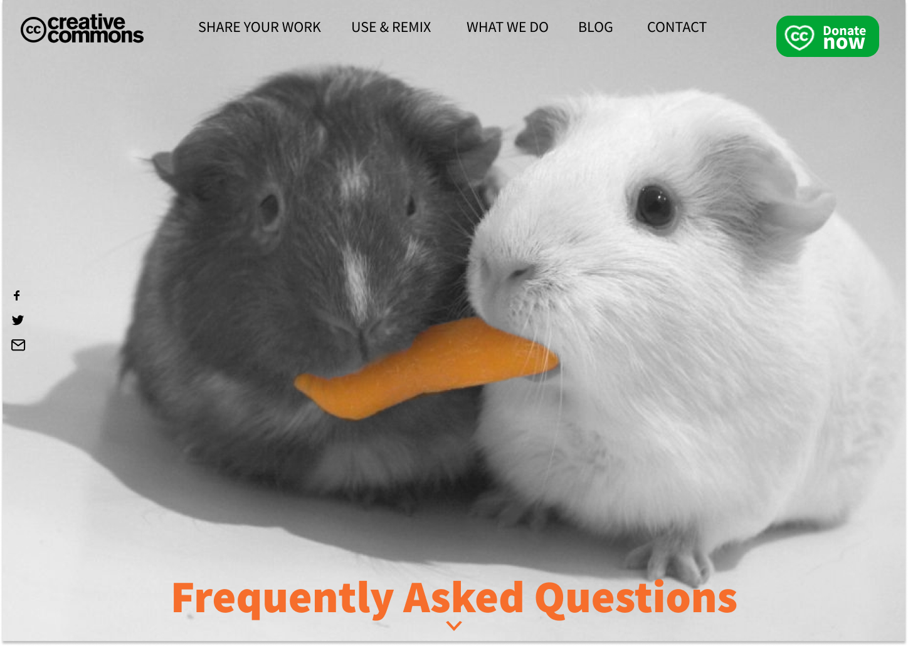
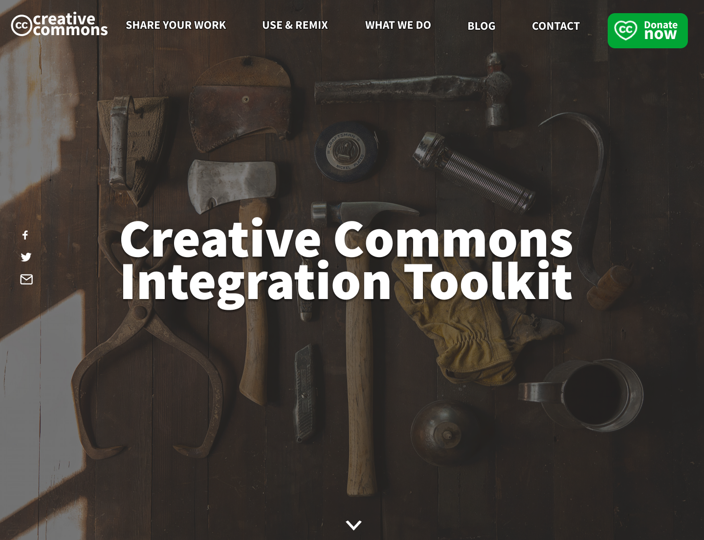

# Creative commons toolkit and FAQ pages

Designs I did in Figma for Creative Commons as a part of the application process for the Outreachy internship. The task was to redesign their toolkit and FAQ pages and make them more modern and more user-friendly.

